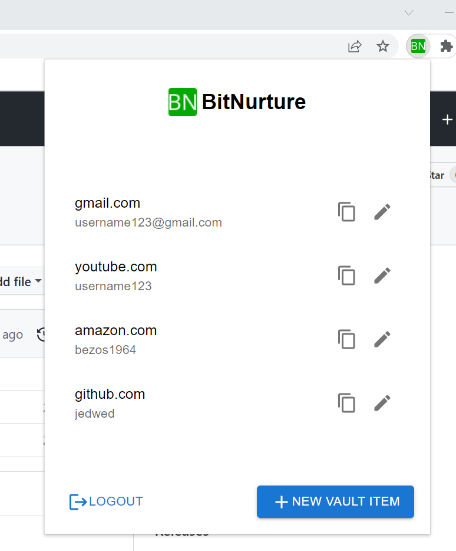

# BitNurture


A Google Chrome browser extension for storing your passwords in a **securely encrypted vault**. You need only **one master password** to access them all!
The browser extension is written using ReactJS, the backend server is written using Python Flask.
(COMP6841 Something Awesome Project)



# Encryption
BitNurture uses your **master password** to generate an **AES-256 CBC master key** used to securely encrypt and decrypt all your vault items. The master key is generated with **PBKDF2: Password Based Key Derivation Function 2**  (100 000 iterations).

All encryption and decryption is performed on the client's side, hence you will never send any unencrypted data over to the server.

PBKDF2 is applied again on the master key before being sent to the server to authenticate users. Hence, both the server and anyone performing a MITM attack will have zero knowledge on your master key or master password.

# Build/Run Instructions
## Run the browser extension
In the `client` directory, run:
```
npm install
npm run build
```
You can now load the extension into Chrome:
1. Type `chrome://extensions` in the address bar
2. Enable developer mode
3. Click "Load unpacked extension" button, select the `build` folder of the project

## Run the backend server
In the `server` directory, run:
```
pip3 install -r requirements.txt
```
And in the project root directory, run:
```
python3 -m src.server
```